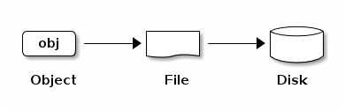

Ceph的框架
===================

# 1 框架

Ceph将对象存储、块存储、文件存储统一到一个存储系统中。
Ceph的目标是实现一个高可靠、易管理、免费的存储系统。
借助于Ceph的力量，可以轻易地转变公司IT部门的结构，还可以管理海量数据。
除此之外，Ceph还拥有超强的扩展能力，能够支持成千上万的客户端。
Ceph的数据容量已持续爆炸性增长到拍字节（Petabytes）和艾字节(Exabytes）。

## 三个重要组成部分

- Ceph Node：构成存储所必须的硬件及相应的守护进程。
- Ceph Storage Cluster：由一系列的Ceph Node组成，位于Cluster中的Ceph Node会相互通信以保持数据的备份及动态地分发。
- Ceph Monitor：Ceph Monitor也是由一系列节点组成，只不过其功能主要是用于监控位于Ceph Storage Cluster中的Ceph Node。可能会问，位于Ceph Monitor中的节点是否也是要监控呢？答案是Ceph Monitor Cluster内部已经采用了高可用的机制。

## Ceph功能结构图

按照Ceph的目标，其功能主要是分为三方面：
- 对象存储：（reliable, autonomic, distributed object store gateway, RADOSGW）一个基于桶的REST端口，能够兼容S3（亚马逊提供的对象存储接口）、及Swift接口（OpenStack提供的对象存储接口）。
- 块存储：（reliable block device, RBD）一个可靠、完全分布式的块设备。并且提供了Linux Kernel Client，以及QEMU/KVM相应的驱动。
- Ceph FS：（Ceph file system, CEPHFS）兼容POSIX的分布式文件系统。给Linux Kernel提供了客户端工具，并且同时支持[FUSE](http://fuse.sourceforge.net/)。

Ceph的功能结构如图1.1所示。
除了Ceph的三个目标之外，此外还有一个功能是直接提供给应用程序。
只不过此时实际功能直接是由底层的RADOS提供，其接口命名为LIBRADOS。

*注意：FUSE是指Filesystem in Userspace。*

图1.1  Ceph系统功能结构图

从图1.1中，可以看出Ceph主要是基于[RADOS](./pdfs/weil-rados-pdsw07.pdf)文件系统实现了其功能。

*注意：RADOS可以参考论文《[RADOS: A Scalable, Reliable Storage Service for Petabyte-scale
Storage Clusters](./pdfs/weil-rados-pdsw07.pdf)》*

# 2 The Ceph Storage Cluster

Ceph在RADOS文件系统的基础上，能够提供一个无限扩张的Ceph Storage Cluster。
Ceph能够提供这么强大的数据功能，那么问题是：Ceph是如何定位一个数据块的呢？
对于Storage Cluster Clients和Ceph OSD Daemon而言，都需要精确地定位一个数据
块的位置。此时就需要借助于CRUSH算法。CRUSH算法并不需要去查看一张“居于中心管
理记录地位的表单”，就可以计算出数据存放的位置。对于上层应用程序而言，Ceph还
提供了“native”的Ceph Storage Cluster的接口librados。此外，一系列服务与程序
都基于librados与RADOS进行交互。

*注意：Ceph OSD Daemon：管理一个逻辑磁盘的后台运行服务。OSD主要是指一个逻辑磁盘。
然而，在Ceph中，经常是把OSD与Ceph OSD Daemon混合使用，这两者很有可能都是指这个后台服务。*

## 存储数据

对于Ceph存储系统而言，数据的来源主要有四种：
- Ceph Block Device
- Ceph Object Storage
- Ceph Filesystem
- APP based on librados

Ceph并不去计较这些数据是从哪里得到的，统一地把这些数据当作对象进行存储。
对象只是一个抽象的称呼而已，如何一个实物对应起来呢？
实际上指的是文件系统上的一个文件。这个文件最终将存放在存储设备上。
在底层上，主要是由Ceph OSD Daemons来处理存储设备上的读写操作。
这也就意味着Ceph的存储经历了：Object->File->Disk的流程。
如图1.2所示：

图1.2  对象存储流程图

Ceph OSD Daemons将所有的数据都当成对象存储在一个平面名称空间中
（也就是说没有层级结构，比如一般的目录树什么的，也都没有了）。
一个对象文件有：
- Identifier：对象文件的ID，整个Cluster中必须没有相同的ID。
- Binary Data：二进制数据，是对象文件数据本身。
- metadata：metadata一般是称之为数据的信息，也称为数据的数据。主要是由一系列健值对构成。metadata主要是在Filesystem中用得比较多，比如文件所有者、创建日期、最近修改日期等等。

图1.3  对象文件示意图

*注意：identifier也就是通常意义上指的ID，对象文件的ID是针对整个Cluster而言的。
需要保证在一个Cluster中，其ID也是唯一的。*

## 扩展性与高可用性

在传统的架构中，client如果想要去系统进行交互，需要与一个控制结点打交道。
在一个复杂而又庞大的系统中，引发的单点故障非常恼火。
这种传统的控制系统会带来三方面的问题：
- 性能制约：由于所有的client都需要与控制结点打交道，会导致控制结节非常繁忙。
- 影响扩展：控制节点所管理的节点数目总归是有限的，当系统扩展时，急剧上升的节点数目会带来易想不到的问题。
- 单点失效：当控制节点宕机之后，整个系统都会变得不可用。

Ceph作为一个高可用、高扩展性的存储系统，肯定是不能采用这种传统的架构。Ceph采取的策略有：
- 无主控节点的结构：Ceph采用了Client工具直接与Ceph OSD Daemons交互的方法。
- 高扩展性：由于没有控制节点的制约，Ceph的扩展变得极为容易。
- 高可用性：Ceph OSD Daemons在存储对象时，除了在它所管理的存储设备上存放数据之外，还会将此数据复制至其他节点，以保证数据的高安全性。
- 高可靠性：Ceph系统除了Storage Cluster之外，还有Monitor Cluster。Monitor Cluster会监控Storage Cluster的运行状态。此外，Monitor Cluster自身也有相应的高可靠机制。

那么，Ceph是如何达到这些目标的呢？主要是利用了CRUSH算法。

### CRUSH算法简介

对于Ceph系统而言，主要是有两类程序需要不停地存取数据：
- Ceph客户端程序：使用Ceph系统的人，把数据存放至Ceph中。
- Ceph OSD Daemons：Ceph OSD Daemons为什么需要经常性地存取数据呢？主要因为Ceph OSD Daemons需要在Ceph Nodes之间同步与复制数据。

不管是Ceph Client还是Ceph OSD Daemons，都是利用了CRUSH算法来定位需要的数据的具体位置，而不是再去查“记录了整个集群信息的表单”。

CRUSH提供的数据管理策略，比以往实现的方法都要好。这种“去中心化”的策略，能够带来良好的扩展性。无论是Ceph Client还是Ceph OSD Daemons查找数据，都是将这个查找定位的工作量分布到整个集群中。此外，CRUSH还利用了弹性的数据复制方案。这种灵活性，可以很轻易将Ceph地扩展至大规模集群。下面将大致介绍CRUSH的操作流程，详细的参考资料请阅读论文《[CRUSH - Controlled, Scalable, Decentralized Placement of Replicated Data](./pdfs/weil-rados-pdsw07.pdf)》。

### Cluster Map

Ceph能够有效地进行分布式数据读取的一个很重要的原因是：假设数据读取方完全了解Cluster的拓扑结构。这也就意味着Ceph Client和Ceph OSD Daemon都了解Cluster的拓扑结构。在读取数据时，就可以直接向相应的Ceph Node要数据了。

那么，Ceph Cluster的拓扑结构是怎么样的呢？首先其拓扑结构，在Ceph中命名Cluster Map。而Cluster Map是如下几种Map的统称：

1. The Monitor Map：包括了Cluster fsid、位置、name address以及每个monitor的端口。也保存着当前的更新点（Ceph Cluster的变动会导致拓扑结构的变动，称之为epoch）。如果要查看一个monitor map，可以运行命令：`ceph mon dump`。

2. The OSD Map：包含了Cluster的fsid、当前map创建时间、最后修改时间、存储池列表、PG数目、OSDs列表及其状态（eg., up, in）。如果要查看一个OSD map，可以运行`ceph osd dump`。

3. The PG Map：包含了PG（placement group）版本、时间戳、最新的OSD map更新点、满载率。此外，还记录了每个PG详细信息：PG ID、Up Set、Acting Set、PG的状态（比如active + clean）、每个存储池中的数据使用频率统计。

4. The CRUSH Map：包含了一系列存储设备以及失败的层次（比如一个设备、主机、机架、一排、一个机房都出现了故障）、以及数据在层次之间的传输规则。如果要查看一个CRUSH map，可以执行以下命令。当拿到解析之后的CRUSH map之后，可以通过`cat`命令进行查看，或者直接用文本编辑器打开。

    ceph osd getcrushmap -o {filename}
    crushtool -d {comp-crushmap-filename} -o {decomp-crushmap-filename}

5. The MDS Map：包含了当前的MDS Map更新点。这个MDS map也包含了存储metadata的存储池、metadata服务器列表、以些这些服务器的状态。如果要查看MDS map的状态，可以执行`ceph mds dump`。

每个map都维护着自己不断被更改的历史记录。Ceph Monitors维护着cluster map的备份（这里面包含着cluster成员、状态、更改记录、Ceph Storage Cluster的健康状态）。

### 高可靠的Monitors

在Ceph Clients或者Ceph OSD Daemons开始读或者写数据之前，需要向Cluster Monitor获取当前最新状态的Cluster Map。有了最新的Cluster Map才能保证读或者写的数据是正常的。由于在读写数据之前，需要先与Cluster Monitor打交道，所以需要保证Cluster Monitor的高可靠性。

一种最简单的办法是：一个Ceph Storage Cluster中只安装一个Ceph Cluster Monitor。这种偷懒的策略会带来单点失效的问题（假如Monitor节点宕机，那么无论是Ceph Client还是Ceph OSD Daemons都无法读取数据）。

为了增加可靠性以及容错性，Ceph支持将Monitors部署成一个集群。在一个Monitors集群中，由于各种潜在的因素，会导致一个或者多个Monitors失效，或者因为Monitors之沟通不同步，以致于不能监控整个Storage Cluster的状态。针对这种情况，在各个Monitor之间，需要达成一定的协议，从而可以统一地监控整个Ceph集群的状态。Ceph除了利用多个Monitors结点之外，还采用了[Paxos](http://en.wikipedia.org/wiki/Paxos_(computer_science))算法来建立不同Monitor结点之间的一致性，从而每个Monitor结点都可以拿到当前Ceph状态，并且拿到的信息是一致的，不同Monitor结点之间不会有差异。

那么这些Monitors是如何配置的呢？请参考《[Monitor Config Reference](http://ceph.com/docs/master/rados/configuration/mon-config-ref/)》。

### 高可靠的认证

Ceph进行认证主要是发生在Ceph client与Ceph Monitors、Ceph OSD Daemnons、Ceph Metadata Servers（这些结点之间也应该有认证信息）。在认证时，主要是采用了Ceph Kerberos似类的认证协议，称之为`cephx`。只有经过认证的用户者可以读、写数据以及执行Ceph命令。

那么，一个问题就是：如果`Cephx`系统失效之后，是不是也会导致整个Ceph系统不可用呢？这样的担心是多余的，因为Ceph的扩展机制与高可用机制也是用在了`Cephx`系统上。更多关于`Cephx`的细节，以及`Cephx`与Kerberos的区别，可以参考《[Ceph Authentication and Authorization](http://ceph.com/docs/master/rados/operations/auth-intro/)》。

### 智能Daemons带来的超强扩展

在很多集群架构上，很多都采用了一种中心化的管理方式：即一个中央节点来管理其他所有的节点，比如一些节点的加入与删除等等。这种中心化的管理方式会遇到双重分发的问题：即请求要先发到中心节点，再收中心节点转发至相应的节点。除去由中心节点失效带来的单点失效的可能性之外，还会遇到的一个问题就是扩张。这种中心化的系统在从拍字节->艾字节的扩张的时候，会遇到性能的瓶颈。

那么Ceph是如何打破这个瓶颈的呢？由前文的介绍可知，涉及到数据操作的，主要是有两个：Ceph Client和Ceph OSD Daemons。这两者在读、写数据块时，都需要具备集群意识。所谓集群意识，打个比方：Ceph OSD Daemons都知道其他Ceph OSD Daemons在集群中的信息。由于有了这些信息，客户端（Ceph Client、Ceph OSD Daemons）可以直接与Ceph相应的结点进行交互。

由于Ceph的客户端、Ceph Monitors、Ceph OSD Daemons可以直接对应的Ceph Nodes进行交互。那么，旧有的中心结点不能支撑的任务，现在可以利用整个Ceph集群的CPU和RAM来进行支持。这种处理方式会带来以下几个方面的好处：

1. OSDs Service Clients Directly：对于任何网络设备而言，所能支撑的链接数目都是有限的。当集群规模上升之后，由于硬件资源的限制，中心化的架构必然会出现不能支撑的情况。通过让Ceph的客户端直接与Ceph相应的结点进行通信，Ceph集群提升了性能、集群扩张性、存储容量。当然，再也不用担心单点失效了。有时候，也需要保存一个session，这个任务就落在了Ceph OSD Daemon上面，而不再是以前那种中心结点了。

2. OSD Membership and Status：Ceph OSD Daemons加入一个集群并且汇报其状态。汇报的内容可能很多，但是最低限度是要求汇报出其相应的状态是属于`up`还是`down`。
   - `up`：表示Ceph OSD Daemons节点的状态是正在运行，可以支撑Ceph Client的请求。
   - `down`：表示Ceph OSD Daemons服务出现错误（不在运行、服务器宕机等等），即不能支撑Ceph Client的请求。

    有趣的是，当Ceph OSD Daemons的状态是Down的时候，其他结点又是如何知道他的状态呢？有两方面的困难：
   - Ceph OSD Daemons进程挂掉了，网络上其他节点上的服务不能与这个进程进行通信。
   - Ceph OSD Daemons进程挂掉了，正常情况下是由它向Monistors节点回报状态的。

    当处于这种情况的时候，如何得知挂掉的Ceph OSD Daemnons的状态呢？主要有下面这两种方法：
   - Ceph Monitor可以定时去Ping Ceph OSD Daemons节点。
   - Ceph Monitor也授权了Ceph OSD Daemons去检查旁边的结点是否处于`down`的状态。这种相互之间的检查可以更新集群的状态，并且把这些信息更新到Ceph Monitor中。

    采取这两种策略之后，Ceph Monitor就可以保留一些轻量级的进程。更多细节参考，《[Monitoring OSD](http://ceph.com/docs/master/rados/operations/monitoring-osd-pg/#monitoring-osds)》及集群《[Heartbeats](http://ceph.com/docs/master/rados/configuration/mon-osd-interaction)》的配置。

3. Data Scrubbling：为了维护数据的永久性与完整性，Ceph OSD Daemons能够从（不同的）placement groups中提取所需要的数据。可能会想到一个问题：为什么Ceph OSD Daemons需要从（不同的）placement groups中提取数据呢？这主要是由于存储系统，为了防止丢失，一般会将数据分割成多份。那么经常需要确定的是，这些多重备份之间会不会产生差异呢？比如某一份被污染了。因此，一种通用的做法就是定时地将这些多重备份数据进行比对。这种数据之间的相互比对（比如设置周期为一天一次），能够有效地发现数据的不一致以及系统错误。不过，这种比对还算是轻量级的，还有一种深层次的比对是一位一位地进行比较。这种深层次的比对由于比较占用时间较长，周期一般设置为一周一次。与轻量级的比对相比，深层次的比较能够发现磁盘上的坏道，而轻量级的比对则达不到这种效果。更多细节参考《[数据比对](http://ceph.com/docs/master/rados/configuration/osd-config-ref#scrubbing)》。

   *placement groups：是指数据逻辑上的分组，打个比方：同一部视频分割成Object之后，可能属于同一个placement group。但是同一个object也有可能有备份存在，这些备份就有可能属于不同的placement group了。*

4. Replication：像Ceph Clients，Ceph OSD Daemons也利用了CRUSH算法。Ceph Clients一般而言是利用CRUSH算法来获取数据存储的位置，以便于读写。而Ceph OSD Daemons主要是利用CRUSH算法获得数据备份的位置。数据的负载均衡也会用到CRUSH算法。下面将介绍Ceph Client写数据的流程：
   - Ceph Client利用CRUSH算法计算出一个object应该存放的位置。
   - Ceph系统将些object与逻辑概念中的存储池、placement group关联起来。并且找出相应placement group中负责的Ceph OSD Daemons。
   - Ceph Client将数据以object为单位，通过相关联的placement group负责的Ceph OSD Daemons写到Ceph系统中。
   - 负责的Ceph OSD Daemons将object的备份分发至二级和三级Ceph OSD Daemons。
   - 当数据写入完成之后，向Ceph Client汇报结果`ok`。

    客户端写数据的流程如下图所示：

    

    图1.4  客户端写数据流程
    
    由于能够对数据完成多重备份，Ceph OSD Daemons解除了客户端对于数据安全性的担心。存储数据的客户再也不用担心数据的可用性与安全性了。

# 动态集群管理

在《扩展性与高可用性》这一节中，介绍了：
- Ceph是如何利用CRUSH算法
- 集群意识（Ceph Client端与Ceph OSD Daemons都有整个集群的信息）
- 智能的Daemons能够扩展及提供高可靠性。

讲了这么多，其实Ceph主要要实现的是这么一个系统：
- 完全能够独立运行
- 自我修复
- 智能化的Ceph OSD Daemons

接下来将要介绍CRUSH是如何工作的？CRUSH算法又是如何让Ceph存储数据的？如何实现负载均衡的？如何动态地管理整个集群的？

## 存储池

Ceph存储系统支持“存储池”的概念。从物理角度上看来，这个存储池并不是真实存在的。只是一系列存储的object，从逻辑上的划分。一个存储池有如下特性：
- 对于Objects的所有者、访问权限
- Object备份数目
- Placement Groups的数目
- CRUSH算法中，适用的规则

*CRUSH算法中，已有一些规则。这些规则对于某些存储池而言，可供选择。*

Ceph Clients从Ceph Monitor中获得Cluster Map，然后再将object写入存储池中。决定这个数据怎么写，主要有以下几个因素：
- 存储池的大小
- 备份的数目
- CRUSH算法的规则
- Placement groups的数目

图1.5  客户端与存储池的交互

## 从PG到OSD的映射

*PG是指placement group*

每个存储池中都有一系列placement groups。CRUSH算法动态地完成了从PG到OSD的映射。当Ceph Client存储object的时候，CRUSH会将每一个object映射至placement group。

如果简单一点的想法，Ceph Client是可以直接和Ceph OSD Daemons进行交互的。现在中间多了一层PG，就需要先将object映射至PG，然后再将PG映射至Ceph OSD Daemons。

### 无PG的设计

为什么要采用带PG的设计呢？回顾Ceph的主要目的：Ceph存储集群是一个可以自由申缩的存储集群。首先看一下那种简单的设计（无PG的设计）：Ceph Client直接与Ceph OSD Daemons进行交互。这种简单的设计会带来什么样的问题？

- 集群扩张的时候，为了负载均衡，会移动一部分数据到新加入的节点。
- 集群中节点的损坏，磁盘故障等因素都会导致数据块的移动。

在这种设计下，由于数据实际存储的位置在不断地发生变动，那么Ceph Client会经常性地去更新整个集群的信息。从而导致Ceph Client与Ceph OSD Daemons产生了较强的耦合性。

### 添加PG的设计

Ceph采用了添PG的设计：即在Ceph Client提交的object存储对象与Ceph OSD Daemons中间添加了一层placement group。这种设计有什么优点？

- Ceph Client在与Ceph存储集群进行交互的时候，只需要知道object与placement group的映射关系。则由于placement group是逻辑的（并不是真实物理存在的），发生变动的可能性很小。因此，Ceph Client与Ceph集群整体信息交互的可能性很小。
- object数据的存储与placement group进行关联，数据的移动，只需要更新与placement group的映射关系就可以了。这部分的工作由Ceph自己完成。

这种添加了一个PG作为中间层的做法，使得Ceph可以自由地申缩。可以随意地添加新的节点与新的磁盘设备。而这种结构上的变动，对于客户端而言，不需要知道。

下图显示了这种映射关系：

图1.5  object、PG及OSD之间的关系

通过Cluster Map及CRUSH算法，Ceph Client可以很容易地计算出应该和哪个OSD进行通讯，从而完成对数据的读写。

## 计算PG的ID

当Ceph Client需要与Ceph Monitor进行交互的时候，首先Ceph Client会获得最新的Cluster Map。利用这个最新的Cluster Map，Ceph Client知道在集群中的所有的monitors，OSDs，以及所有的metadata服务器。尽管知道了这些信息，但是Ceph Client依然不清楚想要的object是存放在什么位置。接下来将介绍如何计算object的存储位置。

对于Ceph Client而言，计算object存储位置需要的输入是：
- object ID
- pool name

*所谓的pool是指：Ceph存放数据的时候，从逻辑上看，是将数据存放在一个命名的pool中的（比如：liverpool）。*

首先，先看一下在存储object时，处理流程是怎么样的：利用object name、hash code、cluster中的OSDs数目、pool name来计算出placement group ID。具体在计算时，流程如下：
- Ceph Client得到pool ID和object ID。比如`pool = "liverpool", object = "john"`。
- CRUSH拿到object ID，并且计算出hash值`hash_value = hash(object_name, object_data)`。
- CRUSH利用计算出的hash值，模上OSD的数目，得到PG的ID：`pg_id = hash_value % number_of_OSD; // pg_id = 0x58.`
- CRUSH利用提供的pool name，比如`liverpool=4`得到pool的ID。`pool_id = get_pool_id(pool_name)`。比如计算出的值`pool_id = get_pool_id("liverpool"); // pool_id == 4.`
- CRUSH将计算出的pool ID做为PG ID的前缀。比如4.0x58。

通过计算得到object的存储位置，比通过查询什么表单啊，通过服务来回调用什么的都要快很多。CRUSH算法允许Ceph Client计算一个object的存储位置，进而直接与相应的OSD进行存/取操作。

## 友谊与集合

在前面的章节中，曾经提到Ceph OSD Daemons会去检查别的OSD Daemons的`心跳`，并且把OSD Daemons的状态返回给Ceph Monitor。除此之外，Ceph OSD Daemons还有一个任务（peering），可以称之为"友谊"。

“友谊”实际上是一个OSD Daemons中的进程，这个进程的主要目的是使处于同一个PG里面的objects、metadata的状态达成一致。事实上，如果“Peering”这个进程出错，Ceph OSD Daemons会[汇报友谊进程出错](http://ceph.com/docs/master/rados/configuration/mon-osd-interaction#osds-report-peering-failure)给Ceph Monitors。通常情况下，“友谊”进程是相互帮忙协助解决问题，从而可以完成相互之间的自我修复（类似于一个班的同学，相互之间克服缺点）。但是也有那种一直无法修复的“Peering”进程，可以参考[如何修复Peering出错](http://ceph.com/docs/master/rados/troubleshooting/troubleshooting-pg#placement-group-down-peering-failure)。毕竟每个班，都有死不悔改，要调皮到底的同学的。

*注意：状态达成一致，并不意味着PG拥有了最新的内容。*

为了保证数据存储的安全，Ceph Storage Cluster在存放object的时候，会保存数据的两份备份。当然，如果要求更高的安全性，可以存放更多的备份数，比如`copy_size=3`。当有备份数存在的时候，数据存放的安全性被分解了，当某个备份失效的时候，其他的备份还可以使用。

回顾《智能Daemons带来的超强扩展》这一小节，会发现在区分各种Ceph OSD Daemons的时候，并没有采用osd.0、osd.1这种命名方式，而是采用了主级OSD、次级OSD依次类推。那么主级OSD有什么功能呢？
- 在Acting Set中，主级OSD是第一个OSD。
- 主级OSD会在所在的PG中，负责与“Peering”进程进行协同。
- 在Ceph Client写数据的时候，当Ceph Client在与PG进行交互的时候，主级OSD是唯一首先与Client进行交互。

那么什么是Acting Set呢？所谓Acting Set是指：当一系列OSD对placement group负责的时候，这一系列OSD便称之为Acting Set。需要明白的是，在一个Acting Set中OSD并不是都是正常运行的。可以想象，并不是任何时候，任何进程都可以正常运行。所以，一个Acting Set中的OSD可以分成两部分：
- `UP Set`：在这个集合中，所有的OSD都在正常运行的。
- `Down Set`：在这个集合中，所有的OSD都出了问题。

由于有了这种区分，当一个PG中的主级OSD进程挂掉之后，可以从`UP Set`中选择一个OSD出来负责PG。比如，在一个Acting Set中，PG的`UP Set`中有osd.25，osd.32，osd.61三个OSD进程。首先将osd.25作为主级OSD。如果这个osd.25挂掉之后，那么次级osd.32将会上升成为负责的OSD，而osd.25将会被移出`UP Set`。

## 负载均衡

如果Ceph集群中新加入了一个Ceph OSD Daemons，会导致cluster map结构更新至加入之后的状态。由于新的Ceph OSD Daemons的加入，除了改变cluster map，也会导致object存储位置的变化。如果回顾《计算PG的ID》，你会发现这里面`number_of_OSD`的值已经发生了变化，在映射时，就会发生错误。

接下来，将介绍在添加新的Ceph OSD Daemons的时候（参考图1.6），reblancing操作是如何进行的。尽管有些粗糙，但是这种情况已经和大一些的集群理论上是一致的。从图1.6中，也可以看出，负载均衡的时候，也并不是OSD相关的PG都会被迁移走，而只是部分被迁移走了。有趣的是，尽管底层在发生变动，但是CRUSH算法仍然是有效的，这是因为object是与PG绑定的原因。

需要注意的是两方面：
- 未移动的PG是占了大多数的，也就是说，大部分数据并未发生迁移。
- 移走的PG对于旧有的OSD而言，扩大了旧有的OSD的空间。
- 当rebanlance完成之后，访问数据也不会发生负载尖刺。

图1.6 负载均衡

## 数据持久性

